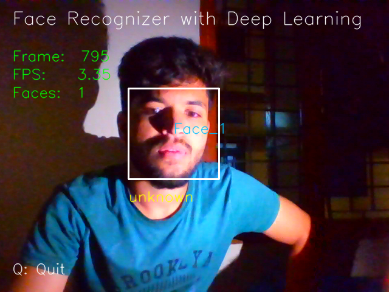

<h1 align="center">Face Recognition Attendance System 🎯</h1>

<p align="center">
  An intelligent attendance management system using real-time face recognition powered by Python, OpenCV, and Dlib.
</p>

<p align="center">
  
</p>

---

## 📌 Overview

The Face Recognition Attendance System is a Python-based application that automates the process of marking attendance using facial recognition technology. It captures faces via webcam, compares them with registered face data, and logs attendance into a local SQLite database. The system features an intuitive GUI and can be used in classrooms, offices, and secured environments.

---

## ✨ Features

- 🔐 **Face Registration** via webcam
- 🧠 **Face Feature Extraction** using `dlib` and `face_recognition`
- 🎥 **Real-time Recognition** and verification
- 🗂️ **Attendance Logging** in a local SQLite database
- 🖥️ **Graphical User Interface** (Tkinter-based)
- 📝 Simple and maintainable codebase

---

## 🧩 Tech Stack

| Component       | Technology Used         |
|----------------|--------------------------|
| Language        | Python 3.x               |
| GUI Framework   | Tkinter (optionally Flask) |
| Face Recognition| Dlib, face_recognition   |
| Image Processing| OpenCV                   |
| Database        | SQLite                   |

---

## 🛠️ Installation

### ✅ System Requirements (Ubuntu/Debian)

```bash
sudo apt-get update
sudo apt-get install build-essential cmake
sudo apt-get install libopenblas-dev liblapack-dev
sudo apt-get install libx11-dev libgtk-3-dev
````

### ✅ Python Dependencies

Create a virtual environment (optional but recommended):

```bash
python3 -m venv venv
source venv/bin/activate
```

Install Python packages:

```bash
pip install -r requirements.txt
```

**Sample `requirements.txt`:**

```
opencv-python
dlib
face-recognition
numpy
pandas
tk
```

---

## 🚀 Getting Started

Follow the steps below to run the application:

### 1️⃣ Register New Faces

Capture and label face data via webcam.

```bash
python get_faces_from_camera_tkinter.py
```

### 2️⃣ Extract Facial Features

Generate a CSV file of facial encodings from the registered images.

```bash
python features_extraction_to_csv.py
```

### 3️⃣ Launch Attendance Recognition

Detect and recognize faces in real-time and mark attendance.

```bash
python attendance_taker.py
```

### (Optional) Launch GUI App

Run the main GUI application.

```bash
python app.py
```

---

## 📁 Project Structure

```
Face-recognization-System/
│
├── app.py                            # GUI launcher
├── attendance.db                     # SQLite database
├── attendance_taker.py               # Attendance marking logic
├── features_extraction_to_csv.py     # Face encoding script
├── get_faces_from_camera_tkinter.py  # Face registration GUI
├── templates/                        # HTML templates (if Flask used)
├── requirements.txt                  # Python dependencies
├── camera_screenshot_02.08.2024.png  # Screenshot of UI
└── README.md                         # Project documentation
```

---

## 📷 Screenshot



---

## ⚠️ Notes

* Ensure your webcam is connected and accessible.
* Run scripts in a well-lit environment for better recognition accuracy.
* The model works offline and stores all data locally.

---

## 📞 Contact

**Developed by**: [Jayanth Rakesh](https://github.com/JayanthRakesh)

For questions, issues, or contributions, please open an issue or pull request on the [GitHub repository](https://github.com/JayanthRakesh/Face-recognization-System-).

---

## 📄 License

This project is licensed under the [MIT License](LICENSE) — feel free to use, modify, and distribute it with attribution.

---
